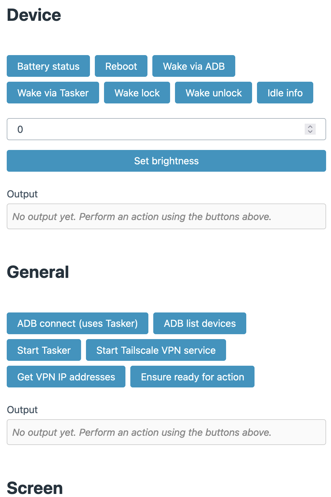
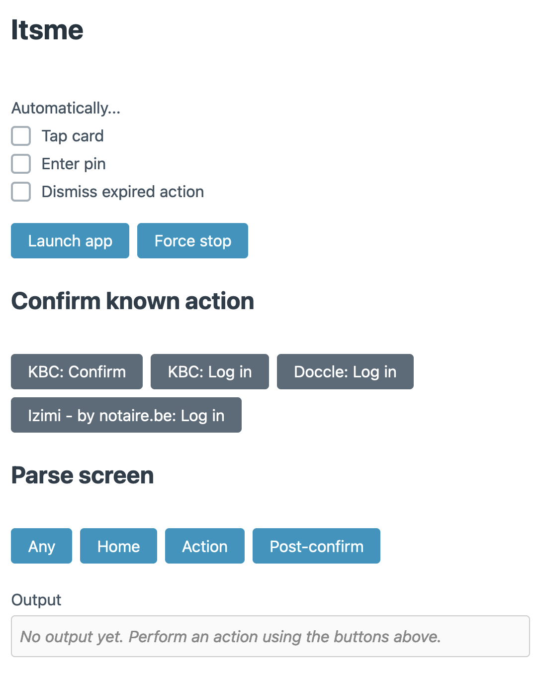

# Droid Remote 🤖🕹️

**Web app and API to remotely control an Android device with adb and [UI
Automator](https://developer.android.com/training/testing/other-components/ui-automator).**

I wanted to automate a few processes on my Android phone, triggerable from a web
app, or from other scripts. This project is essentially an HTTP wrapper around
adb for basic actions, and [UI
Automator](https://developer.android.com/training/testing/other-components/ui-automator)
to tap and interact with elements on screen.

By using UI Automator (similar to [Appium](http://appium.io/docs/) or
[Espresso](https://developer.android.com/training/testing/espresso)),
automations executed by Droid Remote work for practically any app, including
those using
[FLAG_SECURE](https://developer.android.com/reference/android/view/WindowManager.LayoutParams#FLAG_SECURE).
This includes most banking apps, as well as Belgium's de-facto digital identity
provider: [itsme](https://www.itsme.be/en).

## Features

General
- [x] Termux compatible
- [x] Web app and API
- [x] HTTP Basic Auth. username: `admin`, password: `<set with http-basic-password option>`
- [x] Automatically manages Ngrok tunnel (use `ngrok_domain` option)
- [x] Watchdog service

Basic device controls:
- [x] Wake up
- [x] Battery & idle status
- [x] Termux wake lock
- [x] Screen brightness
- [x] Reboot

Adb and app management:
- [x] ADB pair and connect (using Tasker IPC)
- [x] Start Tailscale VPN
- [x] Prepare device for automation (wake lock, set screen brightness, connect ADB)

UI Automator debugging:
- [x] Read device screen hierarchy
- [x] Tap on screen coordinates
- [x] Take screenshot

Itsme:
- [x] Open/force close Itsme app
- [x] Parse any screen (home, action, pinpad...)
- [x] Accept or reject action
- [x] Enter PIN
- [x] Automatically accept action and enter PIN for given known action

## Setup

1. ```git clone https://github.com/ubipo/droid-remote.git```
2. ```cd droid-remote```
3. ```python3 -m venv .env```
4. ```source .env/bin/activate``` (or similar for your shell)
5. ```pip install -r requirements.txt```

## Running

In foreground
```sh
python3 -m droid_remote foreground
```

As a daemon service
```sh
python3 -m droid_remote start
python3 -m droid_remote stop
python3 -m droid_remote restart
python3 -m droid_remote status
```

Using the watchdog service
```sh
python3 -m droid_remote foreground --watchdog
python3 -m droid_remote start --watchdog
python3 -m droid_remote stop --watchdog
python3 -m droid_remote restart --watchdog
python3 -m droid_remote status --watchdog
```

## Configuration

Use:
```sh
python3 -m droid_remote --help
```
...to see all available options.

Options can be set using either (from highest to lowest precedence):
1. Command line arguments: `--name-of-option VALUE`
2. `.env` file: `DR_NAME_OF_OPTION=VALUE`
3. Environment variables: `DR_NAME_OF_OPTION=VALUE`

## Screenshots

Device controls


Itsme automation

